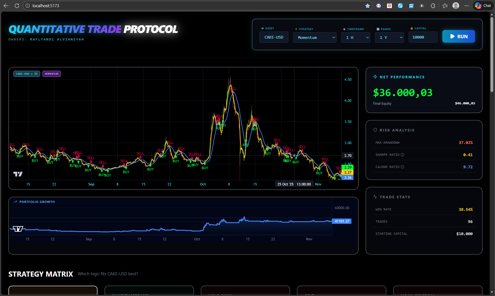
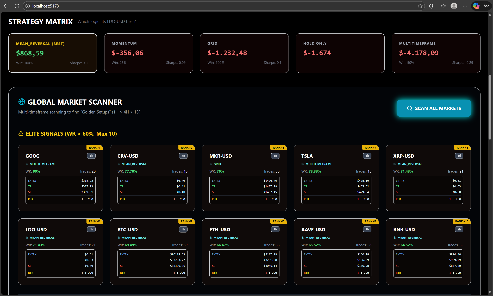
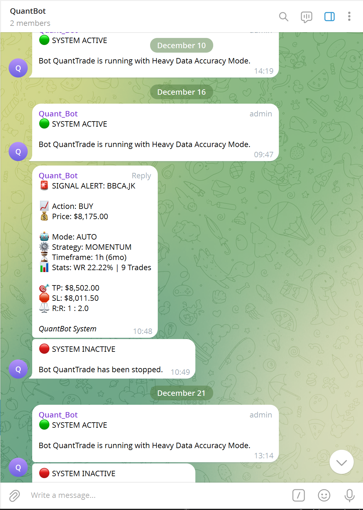

# QuantWeb - Algorithmic Trading & Backtesting Platform 🚀


**QuantWeb** is a comprehensive quantitative trading analysis platform that allows users to backtest strategies, automate market scanning, and receive real-time trading signals via Telegram.

**The Problem Solved:**
* Validating trading strategies using data-driven backtesting instead of intuition.
* Automating 24/7 market monitoring without the need to constantly watch charts.

---

## 📸 Project Showcase

Here is a visual tour of the platform's core capabilities.

### 1. Main Dashboard
**Real-time market overview and active strategy monitoring.**


---

### Core Modules

| **2. Strategy Backtester** | **3. Market Scanner** |
| :---: | :---: |
| *Testing Momentum/Grid strategies on historical data.* | *Scanning sectors (AI, Meme, Big Cap) for high win-rate coins.* |
|  |  |

| **4. Smart Watchlist** | **5. Telegram Integration** |
| :---: | :---: |
| *Database-integrated watchlist for quick access.* | *Real-time BUY/SELL alerts sent directly to your phone.* |
|  |  |

*(Note: Images above are actual screenshots from the live application.)*

---

## 🌟 Key Features

* **Real-time Market Scanner:** Automatically scans the market for coins with the highest Win Rate across various sectors (AI, Meme, Big Cap).
* **Backtesting Engine:** Rigorously tests strategies (Momentum, Mean Reversal, Grid) against historical data.
* **Smart Watchlist:** Integrated watchlist synchronized with the database.
* **Telegram AI Bot:** Automatically sends alert notifications to your phone when the server detects a BUY/SELL signal.

---

## 🛠️ Tech Stack & Architecture

**Data Flow:** `Market Data` -> `Python Backend` -> `Supabase/PostgreSQL` -> `Frontend React` / `Telegram Bot`

| Layer | Technology |
| :--- | :--- |
| **Frontend** | React.js (Vite), Tailwind CSS, Lucide Icons |
| **Backend** | Python, FastAPI, Uvicorn |
| **Database** | Supabase (PostgreSQL) |
| **Trading Libs** | Pandas, Custom Strategy Logic |
| **Notification** | Telegram Bot API |
| **Deployment** | Koyeb (Backend), Vercel (Frontend) |

---

## 💻 How to Run

### A. Local Environment Setup
1.  **Clone Repository:**
    ```bash
    git clone [https://github.com/RaflyandiALV/QuantWeb.git](https://github.com/RaflyandiALV/QuantWeb.git)
    ```
2.  **Environment Variables:**
    Create a `.env` file in the root directory:
    ```env
    DATABASE_URL=your_postgres_url
    TELEGRAM_TOKEN=your_bot_token
    TELEGRAM_CHAT_ID=your_chat_id
    ```

### B. Backend Setup
1.  Navigate to the backend folder and install libraries:
    ```bash
    cd backend
    pip install -r requirements.txt
    ```
2.  Run the Server:
    ```bash
    python -m uvicorn main:app --reload
    ```

### C. Frontend Setup
1.  Navigate to the frontend folder and install packages:
    ```bash
    cd frontend
    npm install
    ```
2.  Run in Development Mode:
    ```bash
    npm run dev
    ```
    *Access the app at `http://localhost:5173/`*

---

## ⚠️ Engineering Challenges & Solutions

**1. Deployment on Linux (Koyeb)**
* **Challenge:** Encountered `ModuleNotFoundError` during cloud deployment.
* **Solution:** Implemented Python Package standards with `__init__.py` and configured `PYTHONPATH` in the runtime environment to ensure proper module resolution.

**2. Database Synchronization**
* **Challenge:** Connecting a relational database with a dynamic real-time dashboard.
* **Solution:** Configured CORS middleware to allow secure communication between the Vercel-hosted Frontend and Koyeb-hosted Backend.

---

## 🔗 Live Demo
* **Live Website:** [Click Here to View App](#) *(Update with your link)*
* **API Documentation:** [Click Here to View Swagger](#) *(Update with your link)*

## 👤 Author
**Raflyandi Alviansyah**
